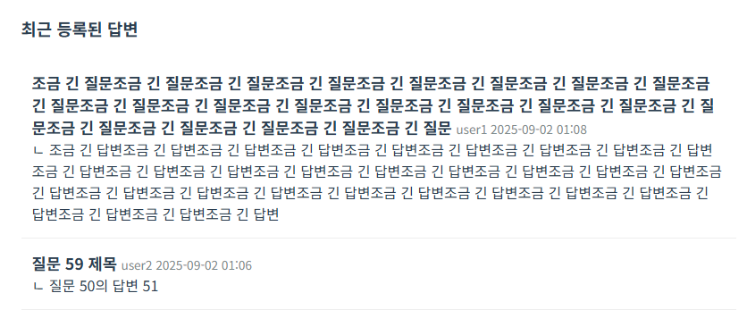
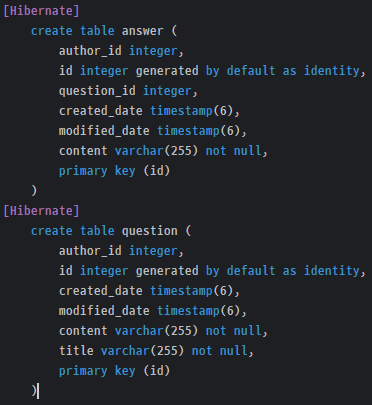

## 📂 프로젝트 파일 구조

```bash
jsb-project/
├── .gitignore
├── build.gradle.kts
├── gradlew
├── gradlew.bat
└── src/
    ├── main/
    │   ├── java/
    │   │   └── com/back/jsb/
    │   │       ├── CommonUtil.java
    │   │       ├── HomeController.java
    │   │       ├── JsbApplication.java
    │   │       ├── domain/
    │   │       │   ├── answer/
    │   │       │   │   ├── Answer.java
    │   │       │   │   ├── AnswerController.java
    │   │       │   │   ├── AnswerForm.java
    │   │       │   │   ├── AnswerRepository.java
    │   │       │   │   └── AnswerService.java
    │   │       │   ├── question/
    │   │       │   │   ├── Question.java
    │   │       │   │   ├── QuestionController.java
    │   │       │   │   ├── QuestionForm.java
    │   │       │   │   ├── QuestionRepository.java
    │   │       │   │   └── QuestionService.java
    │   │       │   ├── reply/
    │   │       │   │   ├── AnswerReply.java
    │   │       │   │   ├── ReplyController.java
    │   │       │   │   ├── ReplyRegisterForm.java
    │   │       │   │   ├── ReplyRepository.java
    │   │       │   │   └── ReplyService.java
    │   │       │   └── user/
    │   │       │       ├── CustomOAuth2UserService.java
    │   │       │       ├── ImageService.java
    │   │       │       ├── PasswordForm.java
    │   │       │       ├── PasswordResetForm.java
    │   │       │       ├── ProfileForm.java
    │   │       │       ├── User.java
    │   │       │       ├── UserController.java
    │   │       │       ├── UserCreateForm.java
    │   │       │       ├── UserRepository.java
    │   │       │       └── UserService.java
    │   │       └── global/
    │   │           ├── initData/BaseInitData.java
    │   │           ├── jpa/entity/BaseEntity.java
    │   │           ├── mail/MailService.java
    │   │           └── security/
    │   │               ├── PasswordUtil.java
    │   │               ├── SecurityConfig.java
    │   │               ├── UserSecurity.java
    │   │               └── UserSecurityService.java
    │   └── resources/
    │       ├── application-dev.yml
    │       ├── application-mail.yml
    │       ├── application-test.yml
    │       ├── application.yml
    │       ├── static/
    │       │   ├── css/style.css
    │       │   └── images/defaultProfile.png
    │       └── templates/
    │           ├── answer_list.html
    │           ├── index.html
    │           ├── layout.html
    │           ├── login_form.html
    │           ├── password_form.html
    │           ├── password_reset_form.html
    │           ├── profile.html
    │           ├── question_detail.html
    │           ├── question_form.html
    │           ├── question_list.html
    │           └── signup_form.html
    └── test/
        └── java/com/back/jsb/
            ├── JsbApplicationTest.java
            ├── domain/answer/AnswerServiceTest.java
            └── domain/user/UserServiceTest.java
```
---
## 🔐 사전 학습 : SpringSecurity

### SecurityFilterChain

스프링 빈 컨테이너에 `SecurityFilterChain`을 등록함으로써, 사용자의 권한에 따른 인가를 설정할 수 있다.

### BCryptPasswordEncoder

> BCryptPasswordEncoder 클래스는 비크립트(BCrypt) 해시 함수를 사용하는데,
> 비크립트는 해시 함수의 하나로 주로 비밀번호와 같은 보안 정보를 안전하게 저장하고 검증할 때 사용하는 암호화 기술이다.
>
> 점프 투 스프링부트 3.06

`SecurityFilterChain.encode()`에 문자열을 전달함으로써 암호화 가능하다.

```java
BCryptPasswordEncoder passwordEncoder = new BCryptPasswordEncoder();
String encodedPw = passwordEncoder.encode(password);
```

매번 인코더의 인스턴스를 생성하는 대신, @Bean으로 등록함으로써 재사용 가능하다.

### UserRole의 ROLE_는 컨벤션

<details><summary> AI 요약 </summary>
Spring Security에서 역할(Role)에 ROLE_ 접두사를 사용하는 것은 규칙이자 컨벤션이며, 이를 통해 Spring Security가 사용자의 권한을 명확하게 인식하고 처리할 수 있기 때문입니다.

ROLE_ 접두사의 중요성
명시적인 역할 식별: Spring Security는 내부적으로 ROLE_로 시작하는 문자열을 "권한(Authority)"이 아닌 "역할(Role)"로 인식하도록 설계되었습니다. 예를 들어, hasRole('
ADMIN')과 같은 표현식은 ROLE_ADMIN 권한을 가진 사용자를 찾습니다.

인증 및 인가 처리: Spring Security는 ROLE_ 접두사를 보고 해당 권한이 사용자의 역할을 나타낸다는 것을 자동으로 이해하고, 역할 기반 접근 제어(role-based access control)를
적용합니다. 이 접두사가 없으면 Spring Security가 이를 단순한 권한(GrantedAuthority)으로만 인식하여 hasRole()과 같은 메서드가 제대로 작동하지 않을 수 있습니다.

따라서, UserRole.ADMIN을 ROLE_ADMIN으로 정의하는 것은 Spring Security 프레임워크와의 약속이자, 개발자가 의도한 역할 기반 보안 기능을 정확하게 구현하기 위한 필수적인 방법입니다.


</details>

### UserSecurityService는 UserDetailsService를 상속하여 구현

`loadUserByUsername`을 구현해야한다.
- DB에서 유저 정보를 찾아내고 username, password, `Collection<GrantedAuthority>`를 전달하여 UserDetails를 반환해야 한다.
- `GrantedAuthority`의 구현체인 `SimpleGrantedAuthority`의 생성자에 권한을 나타내는 문자열 ROLE_~를 전달하면 된다.
- 이러한 ROLE_A, ROLE_B와 같은 문자열은 컨트롤러 메소드에 `@PreAuthorize("hasRole('A')")`를 붙여 페이지 접근 권한을 부여하거나,
- `<div sec:authorize="hasRole('ADMIN')">`를 통해 페이지에서 특정 부분만 노출되도록 할 수 있다.


반환값인 UserDetails는 구현체로 User와 MutableUser가 있다.

| 특징         | **`User` (불변)**                         | **`MutableUser` (가변)**                        |
|:-----------|:----------------------------------------|:----------------------------------------------|
| **변경 가능성** | **불변(Immutable)**: 한 번 생성되면 변경할 수 없습니다. | **변경 가능(Mutable)**: setter 메서드로 값을 바꿀 수 있습니다. |
| **주요 용도**  | **일반적인 표준** 인증 및 권한 부여에 사용됩니다.          | 테스트 또는 특별한 경우에만 제한적으로 사용됩니다.                  |
| **보안**     | **매우 안전**합니다.                           | 의도치 않은 변경 위험이 있어 **주의가 필요**합니다.               |
| **권장 상태**  | **적극 권장**되며, Spring Security의 표준입니다.    | 제한적인 경우를 제외하고 사용하지 않는 것이 좋습니다.                |                                 |


### AuthenticationManager

인증을 처리하는 객체. 빈 컨테이너에 등록된 `UserSecurityService`와 `PasswordEncoder`를 내부적으로 사용한다.

마찬가지로 Bean에 등록하여 사용하자.

→ 직접 등록하지 않아도 FilterCharin, UserSecurityService, PasswordEncoder를 참고하여 자동으로 Spring이 생성하여 등록하여 줌

### login, logout POST 요청은 컨트롤러 작성할 필요 없음

`SpringConfig`에서 사용자가 설정한 `SecurityFilterChain`의 정보에 따라 인터셉트되어 처리된다.

뷰 템플릿에서의 action이나 href의 경로만 잘 맞도록 설정해주면 된다.

```java
    http
                .formLogin(formLogin -> formLogin
                        .loginPage("/siteusers/login")
                        .defaultSuccessUrl("/"))
                .logout(logout -> logout
                        .logoutUrl("/siteusers/logout")
                        .logoutSuccessUrl("/")
                        .invalidateHttpSession(true));
```


# 기본 기능 구현

## 1. 회원 기능

### 회원가입


| 항목            | 내용                                                     |
| ------------- |--------------------------------------------------------|
| 🌐 **URL**    | `/user/sign`                                           |
| ⚙️ **Method** | `GET`, `POST`                                          |
| 🧾 **입력 필드**  | `username`, `nickname`, `password`, `passwordConfirm`  |

#### ✨ 기능 설명
- 새로운 사용자 등록

#### ⚠️ 예외 처리
- **Redirect + 안내 메세지**
    - 없음
- **폼 재렌더링 + 입력값 유지 + 필드별 오류**
    - 필드가 공백일 때
    - username/nickname이 중복될 때
    - 비밀번호가 불일치 할 때

---

### 로그인


| 항목            | 내용                     |
| ------------- | ---------------------- |
| 🌐 **URL**    | `/user/login`          |
| ⚙️ **Method** | `GET`, `POST`          |
| 🧾 **입력 필드**  | `username`, `password` `remember-me`|

#### ✨ 기능 설명
- `Spring Security` 사용
- 사용자 인증 후 로그인
- 로그인 유지(세션 관리)

#### ⚠️ 예외 처리
- **Redirect + 안내 메세지**
    - 로그인 실패 시
- **폼 재렌더링 + 입력값 유지 + 필드별 오류**
    - 없음

---

### 로그아웃
| 항목            | 내용             |
| ------------- | -------------- |
| 🌐 **URL**    | `/user/logout` |
| ⚙️ **Method** | `POST`         |

#### ✨ 기능 설명
- `Spring Security` 사용
- 사용자 로그아웃 처리
- 세션 종료

#### ⚠️ 예외 처리
- **Redirect + 안내 메세지**
    - 없음
- **폼 재렌더링 + 입력값 유지 + 필드별 오류**
    - 없음

---

## 2. 질문 기능

### 질문 등록


| 항목            | 내용                 |
| ------------- | ------------------ |
| 🌐 **URL**    | `/question/write`  |
| ⚙️ **Method** | `GET`, `POST`      |
| 🧾 **입력 필드**  | `title`, `content` |

#### ✨ 기능 설명
- 새로운 질문 등록
- 로그인 한 사용자만 이용 가능

#### ⚠️ 예외 처리
- **Redirect + 안내 메세지**
    - 로그인하지 않고 post 요청을 보냈을 때
- **폼 재렌더링 + 입력값 유지 + 필드별 오류**
    - 입력 필드가 공백일 때

--

### 질문 목록 / 검색


| 항목             | 내용                                                           |
|----------------|--------------------------------------------------------------|
| 🌐 **URL**     | `/question/list`                                             |
| ⚙️ **Method**  | `GET`                                                        |
| 🔎 **쿼리 파라미터** | `types`(검색 조건: title, content, author, answer)<br>`keyword`(검색어) |


#### ✨ 기능 설명
- 질문 목록 조회
- 각 목록 아이템에는 `제목, 작성자, 작성일`이 표시됨
- 검색 조건(`types`)은 복수 선택 가능
    - 조건들은 OR로 연결되어 검색
    - ex) `types=title&types=content&keyword=스프링` : 제목이나 내용에 "스프링" 포함된 질문 검색
- 검색 후에도 기존 검색 조건/키워드가 유지

#### ⚠️ 예외 처리
- 검색어가 없으면 전체 목록 조회
- 검색 조건이 null일 경우 전체로 간주하고 목록 조회

---

### 질문 상세


| 항목              | 내용                      |
| --------------- | ----------------------- |
| 🌐 **URL**      | `/question/detail/{id}` |
| ⚙️ **Method**   | `GET`                   |

#### ✨ 기능 설명
- 개별 질문 상세 정보 조회
- 질문 제목, 내용, 작성자, 작성일/수정일, 답변 목록 표시됨
- 로그인한 사용자라면 해당 질문에 답변 작성 가능
- 본인이 작성한 질문이라면 수정/삭제 버튼 노출

#### ⚠️ 예외 처리
- **Redirect + 안내 메세지**
    - 해당 질문글이 존재하지 않을 때
- **폼 재렌더링 + 입력값 유지 + 필드별 오류**
    - 없음

---

### 질문 수정 / 삭제
| 항목            | 내용                                               |
| ------------- | ------------------------------------------------ |
| 🌐 **URL**    | `/question/modify/{id}`, `/question/delete/{id}` |
| ⚙️ **Method** | `GET`, `POST`                                    |

#### ✨ 기능 설명
- 본인이 작성한 질문을 수정 / 삭제
- 수정 성공 시 질문 상세 페이지로 리다이렉트
- 삭제 성공 시 질묵 목록 페이지로 리다이렉트

#### ⚠️ 예외 처리
- **Redirect + 안내 메세지**
    - 본인이 아닌데 접근했을 때
    - 질문이 존재하지 않을 때
- **폼 재렌더링 + 입력값 유지 + 필드별 오류**
    - 수정 시 입력 필드가 공백일 때

---

## 3. 답변 기능


### 답변 작성
| 항목            | 내용                            |
| ------------- | ----------------------------- |
| 🌐 **URL**    | `/answer/write/{question_id}` |
| ⚙️ **Method** | `POST`                        |
| 🧾 **입력 필드**  | `content`                     |

#### ✨ 기능 설명
- 질문 상세 페이지에서 답변 작성 가능
- 로그인 한 사용자에게만 답변 등록 버튼 활성화

#### ⚠️ 예외 처리
- **Redirect + 안내 메세지**
    - 로그인하지 않았을 때
    - 해당 질문이 존재하지 않을 때
- **폼 재렌더링 + 입력값 유지 + 필드별 오류**
    - 입력 필드가 공백일 때

---

### 답변 수정 / 삭제
| 항목            | 내용                                                                                     |
| ------------- | -------------------------------------------------------------------------------------- |
| 🌐 **URL**    | `/answer/modify/{question_id}/{answer_id}`, `/answer/delete/{question_id}/{answer_id}` |
| ⚙️ **Method** | `GET`, `POST`                                                                          |


#### ✨ 기능 설명
- 질문 상세 페이지에서 답변 수정/삭제 가능
- 본인이 작성한 답변의 경우 수정/삭제 버튼 노출

#### ⚠️ 예외 처리
- **Redirect + 안내 메세지**
    - 본인이 아닌데 접근했을 때
    - 해당 답변이 존재하지 않을 때
- **폼 재렌더링 + 입력값 유지 + 필드별 오류**
    - 수정 시 입력 필드가 공백일 때
---
## Q & A

1. Principal이 아니라 UserSecurity를 따로 만들어서 사용한 이유

    Spring Secuirty가 제공하는 Principal의 경우 간단하게 username 정도만 가져올 수 있는 것으로 알고 있음  
    nickname과 같이 따로 정의한 User 필드값을 가져오기 위해 UserDetails를 구현한 UserSecurity를 사용함

2. ReqestParam으로 값을 받지 않고 DTO로 받은 이유

    Entity의 경우 값이 변경되면 DB에 직접적으로 반영되기 때문에 DTO로 받음  
    이럴 경우 사용자에게 꼭 노출되어야 하는 부분만 떼어낼 수 있다는 장점이 있음
    RequestParam이 아니라 DTO로 Form값을 직접 받을 경우,
    DTO에서 걸어준 Validation이 적용되어 BindingResult를 통해 쉽게 오류를 처리할 수 있어 사용함

---

# 추가 기능 구현

## 프로필 화면 - 김은주

### 스크린샷


### 구현 개요
- 회원가입 시 **프로필 사진 지정** 가능
- 프로필 페이지(`/user/profile`)에서 회원 정보 **조회 및 수정** 가능
  - 프로필 사진 업로드/삭제(기본 이미지)/변경 취소(기존 DB 이미지)
  - 닉네임 변경
  - DB 정보와 동일한 경우엔 저장 버튼 비활성화 = 변경 사항이 있을 때만 버튼 활성화
  
### 구현 방법
- `User` 엔티티에 `profileImage(BLOB)` 필드 추가
- `UserCreateFrom` DTO에 프로필 이미지(`MultipartFile`) 필드 추가
- `ProfileForm` DTO를 통해 프로필 이미지(`MultipartFile`), 닉네임, 삭제 여부를 전달
- `ImageService`에서 `Base64` 인코딩 처리
    - 뷰에서 `` 태그에 바로 출력 가능하도록
- 프로필 이미지가 없으면 DB에는 `null`로 저장, 뷰에서는 기본 이미지 출력

### 이미지 데이터 타입
1. `Multipartfile`
    - 정의 : 스프링에서 제공하는 파일 업로드 타입
    - 사용 이유 : `input type="file"`은 데이터를 바이너리로 전송하므로 `MultipartFile`로 받아야 함
    - 적용 : `ProfileForm`, `UserCreateForm`에서 `MultipartFile` 타입으로 `profileImage` 선언

2. `Base64`
   - 정의 : 바이너리 데이터를 텍스트로 인코딩하는 방식
   - 사용 이유 : DB에서 저장된 `byte[]` 이미지나 `MultipartFile` 이미지를 그대로 뷰에 넘기면 `` 태그에서 표시 불가능
     - Base64로 인코딩 후 `data:imgae/png;base64...` 형태로 변환하여 출력
   - 적용 : `ImageServie`에서 이미지를 `Base64` 형태로 변환, `Controller`에서 `model`에 담아 뷰에 전달

### 트러블 슈팅
1. `MultipartFile`과 `byte[]` 타입 불일치
   - 문제 : 처음엔 `User` 엔티티의 `byte[]` 필드와 똑같이 받으려 했으나, 파일 업로드 시 `MultipartFile` 타입이 전달됨
   - 해결 : DTO에서는 `MultipartFile`로 받고, DTO를 Entity로 변환하는 과정에서 해당 이미지를 `btye[]`로 변환

2. 삭제/변경 구분 불가
    - 문제 : 수정 시 DB에 사진이 저장되어있는 경우, `사진 삭제`를 눌러 기본 이미지로 변경한 경우와 사진을 변경하지 않았을 경우 모두 null로 넘어가 구분이 불가능함
    - 해결 : `deleteProfileImage`라는 플래그 추가
      - true : 기본 이미지로 변경했다는 뜻이므로 DB에는 null로 저장
      - false : false일 경우 이미지가 변경되지 않았으므로 넘어온 값은 null이지만, 기존 이미지를 그대로 유지하면 됨(null로 변경하는 것이 아님!)

3. 닉네임 오류 발생 시 이미지 미리보기 유지 안됨
   - 문제 : 닉네임이 공백으로 넘어가 폼을 재렌더링할 경우, 기존에 변경한 이력(ex : 변경된 이미지)은 그대로 유지하고 싶었지만 원래 DB 이미지로만 재렌더링됨
   - 해결 : `profileImageCurrent`와 `profileImageOriginal` 둘 다 도입
       - `profileImageCurrent` : form에 담긴 변경하려했던 이미지를 Base64로 인코딩한 이미지
       - `profileImageOriginal` : 원래 DB이미지를 Base64로 인코딩한 이미지
       - 폼 재렌더링할 떄에는 Current를 넣어주고, 변경 이력을 확인하여 저장 버튼을 활성화할 땐 DB이미지를 기준으로 하도록 변경

---

## 비밀번호 변경 및 초기화 - 최원제

## 개요
사용자의 **비밀번호 수정** 기능과 **비밀번호 초기화** 기능을 구현하였습니다.  
비밀번호 초기화 시에는 회원 가입 시 입력한 이메일로 초기화된 비밀번호가 발송되도록 하였습니다.

---

## 세부 설명

### 1. 비밀번호 수정


로그인 시 상단 메뉴바에서 비밀번호 변경 항목을 확인할 수 있습니다.


비밀번호 변경 화면에는 다음과 같은 입력창이 있습니다.
- 기존 비밀번호
- 신규 비밀번호
- 신규 비밀번호 확인

입력 후 **변경 버튼**을 누르면 비밀번호가 변경됩니다.  
비밀번호 변경 조건은 다음과 같습니다.

- 기존 비밀번호가 올바르게 입력되어야 함
- 신규 비밀번호는 기존 비밀번호와 동일하지 않아야 함
- 신규 비밀번호 확인 입력란과 동일해야 함.

---

### 2. 비밀번호 초기화


로그인 화면 아래의 링크를 통해 비밀번호 초기화 화면으로 들어갈 수 있습니다.


비밀번호 초기화 과정은 다음과 같습니다.

1. 초기화 화면에서 계정 아이디 입력
2. 존재하지 않는 계정일 경우 오류 반환
3. 정상 계정일 경우 비밀번호 초기화 진행
4. 변경된 비밀번호가 계정 이메일로 발송됨


발송된 이메일은 위의 사진과 같습니다.

---

## 기타 변경 사항 및 참고 사항

### User Entity 수정
- User Entity에 `email` 속성을 추가하였습니다.
- `initData`에서도 User 생성 시 이메일을 넣도록 수정하였습니다.

### SMTP 설정
비밀번호 초기화 기능 구현을 위해 **Naver SMTP**를 사용하였습니다.  
이를 위한 설정은 `application-mail.yml` 파일에 작성되며, 보안 상 해당 파일은 깃허브에 업로드하지 않았습니다.  
아래 예시를 참고하여 직접 작성해야 합니다.


```YAML
spring:                           # 예시에서는 네이버 SMTP 사용중
  mail:
    host: smtp.naver.com          # 네이버 SMTP 서버 주소
    port: 465                     # 네이버 SMTP 포트 번호
    username: xxxxxxx@naver.com    # 네이버 이메일
    password: xxxxxxxxxxx          # 네이버 비밀번호
    properties:
      mail:
        smtp:
          auth: true              # 사용자 인증 여부
          ssl:
            enable: true
            trust: smtp.naver.com
```

관련 참고 링크:  
- [[Java] NAVER 메일 SMTP 환경 설정 방법](https://adjh54.tistory.com/596)


> ⚠️ **주의:**  
> `yml` 파일의 `spring.mail.password`는 네이버 계정 비밀번호가 아닌,  
> POP3/SMTP 사용 설정 시 발급할 수 있는 **전용 어플리케이션 비밀번호**를 사용해야 합니다.

##  ⏱️ 최근 답변·댓글 정렬 - 김희수

### 개요

최근 답변은 `/answer/list` URL 사용합니다.

뷰 템플릿은 `answer_list.html` 사용합니다.

최근 답변과 답변이 달린 질문의 제목이 같이 보이는 구조입니다.

### 스크린 샷


<br>
네비바 최근 답변 추가
<br><br><br>


<br>
최근 답변 페이지 UI
<br><br><br>

### 그외 주요 변경사항

Question의 answers 초기화 누락된 것 추가했습니다.

페이징 기능 확인을 위해 `BaseInitData`의 더미데이터 반복문 추가됐습니다.

README_recent_comment.md에 간단히 문서화 하였습니다.

### 🚀 트러블 슈팅

```html

<html layout:decorate="~{layout}">
<div layout:fragment="content" class="page-container">
    <div th:each="answer : ${answers}">
        <!--   문제가 된 부분 StackOverFlow     -->
        <div th:field="${answer.question}">

        </div>
        <div th:field="${answer.content}">

        </div>
    </div>
</div>
```

answer -> question -> question이 List<answer>를 가져 다시 처음의 answer를 참조 -> 무한 재귀

🔎 th:field는 내부적으로 `Spring DataBinder`의 바인딩 기능을 사용하기 위해 객체그래프 탐색을 시도한다.

👉 대신에 th:text를 통해 필요한 answer.question.toString()만 호출 하도록 한다.

### UI 변경




시행착오를 통해 그나마 괜찮은 형식으로 바꾸었다.

### `TransientObjectException `

비영속인 객체를 영속인 객체와 함께 저장하려고 하면 발생하는 예외

test에서 간단하게 객체들을 생성하고 persist 하지 않고 사용하려고 했다가 발생했다.



```java
@Column(columnDefinition = "TEXT")
private String content;
```

## 💬 답글 기능 - 김희수
### 개요

service에서 repository에 접근하여 CRUD기능을 구현한 question, answer와 다르게

entity의 속성 변경과 dirtychecking 위주로 구현을 시도해보았다.

답글은 등록과 삭제기능만 존재한다.

답글들은 답변을 삭제하면 같이 삭제된다.

### 스크린샷


답변(answer)의 본문을 누르면 답글 등록 폼이 나타난다.


로그아웃 상태에서는 등록할 수 없다.


삭제는 등록한 사용자만 삭제할 수 있다.


### 추가 목표였던 것

답변이 답글이 없는 상태로 삭제하면 hard delete 되지만

답글이 있는 상태로 삭제되면 삭제된 답변입니다. 라고 사용자에게 보여지며

답글들은 여전히 사용자에게 노출될 수 있는 soft delete기능을 구현하고자 하였으나

테스트 트러블 슈팅에 시간이 많이들었고, 시간이 부족하여 작성하지 못했다.

### 멘션기능

답글을 굳이 구현할 필요없이 @멘션 기능을 이용하여 답글과 유사한 기능을 사용자에게 제공하는 방법도 있다.

해당 코드에는 구현하지 않았음


## 🚀 트러블 슈팅
### reply 제거

```java
// 수정 전
replies.removeIf(reply -> reply.equals(replyId));

// 수정 후
replies.removeIf(reply -> reply.getId() == replyId);
```
수정 전처럼 코드를 잘못 작성 하였었다.

equals자체가 Object에서 선언된 메소드라 매개변수 타입 자체를 Object로 받아들여서

컴파일 에러가 발생하지 않아 버그감지에 시간이 좀 걸렸다.

### 테스트코드 작성

테스트 코드 작성 자체보다는 테스트 환경설정이 가장 큰 문제가 되었고, 시간이 많이 소요되었다.

ApplicationRunner를 통해 test프로필로 데이터를 초기화 하는 방법은 예외가 발생했는데 해결하지 못하였다.

`@DirtiesContext(classMode = DirtiesContext.ClassMode.AFTER_EACH_TEST_METHOD)`를 테스트 클래스에 추가하여

해결하긴 하였으나, 컨텍스트를 지속적으로 초기화 하여 테스트가 상당히 느리다.

다른 방법으로도 해결할 수 있으면 좋을 것 같다.


## 📚 기본기능 코드 비교 및 리뷰 중 학습

### @NotEmpty VS @NotBlank

| 어노테이션      | 대상                                   | Null 허용 여부 | 빈 값(`""`) 허용 여부 | 공백(`"   "`) 허용 여부 |
|:----------------|:---------------------------------------|:-----------|:----------------|:------------------|
| **`@NotEmpty`** | `String`, `Collection`, `Map`, `Array` | ❌          | ❌               | ✅                 |
| **`@NotBlank`** | `String`                               | ❌          | ❌               | ❌                 |

### SiteUser의 경우 수정일이 불필요한데 BaseEntity를 상속해도 좋을까?

(생각 변경됨 : 비밀번호 변경등 수정사항 충분히 발생할 수 있음)

AI에게 질문한 결과 설계의 일관성을 제외한 부분이 부정적이었음


<details><summary> AI의 근거 </summary>

📌 장점

관리가 단순하다 → 하나의 BaseEntity만 있으면 됨

모든 엔티티에 createDate, modifyDate가 보장되므로 쿼리/조회 시 일관성 있음
(예: 최근 수정된 순 정렬 같은 기능을 거의 모든 도메인에 바로 적용 가능)

스프링 데이터 JPA의 Auditing 기능을 한 번만 적용하면 된다.

📌 단점

실제로 수정일이 필요 없는 엔티티에도 modifyDate 컬럼이 생김
→ DB 설계 상 “이 필드는 왜 있지?” 라는 의문을 남길 수 있음

ISP 위반
클라이언트가 사용하지 않는 기능에 의존하게 됨
SiteUser는 modifyDate가 필요 없는데 강제로 가지게 됨

도메인 모델 관점에서 불필요한 속성이 섞여 있음

데이터베이스 리소스 낭비

📌 적합한 상황

프로젝트 성격상 거의 모든 엔티티가 수정일을 갖는 경우
(예: 게시글, 댓글, 주문, 상품, 결제 등 대부분 수정될 수 있는 비즈니스 도메인)

운영 편의성(정렬, 로그 추적 등)이 일관성을 더 중요하게 여길 때

</details>

```java

@Getter
@MappedSuperclass
@EntityListeners(AuditingEntityListener.class)
public abstract class BaseEntity {

    @Id
    @GeneratedValue(strategy = GenerationType.IDENTITY)
    private int id;

    @CreatedDate
    private LocalDateTime createDate;
}

@MappedSuperclass
public abstract class BaseTimeEntity extends BaseEntity {

    @LastModifiedDate
    private LocalDateTime modifyDate;
}
```

대신 다음과 같은 계층적 구조를 추천함

현재 Entity가 총 3개밖에 없고 Answer와 Question만 id, 생성일, 수정일을 갖고 있으므로

이러한 계층적 구조를 도입하지는 않고 Answer와 Question만 3개의 속성을 갖는 BaseEntity를 상속하도록 함.

❗ SiteUser또한 비밀번호 변경 등 수정이 일어날 가능성이 있으므로, 나중에 정말 불변한 Entity가 생긴다면
계층적 구조를 고려하여 보자.

### @Id인 필드에 Wrapper VS Primitive

null 값을 부여할 수 있는 Wrapper 클래스를 사용하는 것이 권장된다.

[하이버네이트 사용자 가이드](https://docs.jboss.org/hibernate/orm/5.3/userguide/html_single/Hibernate_User_Guide.html#entity-pojo-constructor)

### 이름이 동일한 어노테이션 뭘 써야할까?

@Id
- JPA표준인 Jakrta를 사용해야한다.
- Spring은 @ID 특정 DB에 사용되는 어노테이션이다.

@Transactional
- 기능이 많은 Spring을 사용하면 된다.

### bindingResult.rejectValue의 두번째 매개변수 errorCode

`messages.properties`에서 정의된 메시지를 찾아 매핑하여 반환한다.

```java
passwordInCorrect=패스워드와 확인패스워드가일치하지 않습니다.
...
```

## 🚀 트러블슈팅

### 삭제처리

**과정**

삭제를 위해 코드를 작성하는 도중 JPARepository에 `delete`, `deleteById` 두 가지 메소드가 있는 것을 발견했다.

이에 service에서 새로 정의한 findById -> delete로 진행하는 대신 바로 deleteById를 사용할지 고민했다.

한편, deleteById를 살펴보니 내부적으로 JpaRepository.findById를 사용하고 있었다.

그래서 이러한 상황에서 내가 service에서 예외 메시지를 정의한 findById를 재사용 할지, repository의 deleteById를
사용하는 것이 좋을지 AI에게 피드백 받았다.

동작의 큰 차이는 없지만 간결성 VS 예외메시지 일관성에 대한 의견을 듣고 싶었다.

```java
public Question findById(Integer id) {
    return questionRepository.findById(id)
            .orElseThrow(() -> new EntityNotFoundException(NOT_FOUND_BY_ID.formatted(id)));
}
```

그런데 이 과정에서 existById라는 새로운 메소드를 추천 받았고, existById -> deleteById가 DB 접근 횟수 2회,
내가 제시한 코드는 DB접근 횟수 3회라는 피드백을 해주었다.

그리고 1회의 DB접근으로 해결가능한 JPQL 직접 작성하기도 제시하였다.

**결론**

일단 existById는 SQL로 `SELECT 1 FROM question WHERE id = ?`와 같은 SQL을 작성해 디스크나 메모리에서 Entity의 값을 불러오는 findById보다
빠른 존재 여부를 조회할 수 있다.

그런데, deleteById 자체가 다시 findById를 호출하므로
이 코드가 DB 접근 횟수 3회의 코드, 반대로 처음 제시한 코드가 2회가 된다.

논지가 살짝 바뀌어서 existById를 사용할지 말지에 대한 고민으로 바뀌었지만 결국 트러블슈팅 과정속에서

내부코드와 JPA 동작에 대해 리마인드하며 deleteById가 findById -> delete보다 특별히 최적화가 이루어지는 것이 아니라는 확신이 들었고

내가 service에서 선언한 findById를 사용하는 것이 좋겠다는 결론을 내리게 됐다.

### answer저장

관계의 주인인 answer가 아닌 question에서 참조변수를 지정하려고 하였다.

```java
// 변경 전
public Answer write(Integer questionId, AnswerForm answerForm) {
    Question question = questionService.findById(questionId);
    Answer answer = new Answer(answerForm.content());
    question.getAnswers().add(answer);

    return answerRepository.save(answer);
}


// 변경 후 
public Answer write(Integer questionId, AnswerForm answerForm) {
    Question question = questionService.findById(questionId);
    Answer answer = new Answer(answerForm.content(), question);

    return answerRepository.save(answer);
}
```

## 👀 2주차 구현중 기본기능 버그 수정 

### 1 대 다 연관관계 초기화 문제
```java
@OneToMany(mappedBy = "question", cascade = {CascadeType.PERSIST, CascadeType.REMOVE})
private List<Answer> answers = new ArrayList<>();
```
answers가 기존에 = new ArrayList<>(); 초기화 하지 않는 실수가 있었음

### ddl 자동생성 문제

view에서 content의 칼럼 설정이 없어, 자동생성된 content 칼럼이 varchar(255)로 선언됨

### BaseInitData PK값 타입

BaseInitData의 각 entity들의 키가 int로 선언된 것과

repository의 두번째 제네릭이 으로 선언되어 불일치한 것을 확인 할 수 있었다.

▶️ repository의 두번쨰 매개변수 타입은 엔티티의 키 타입이다.