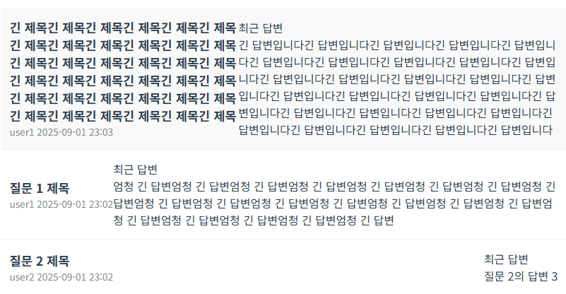
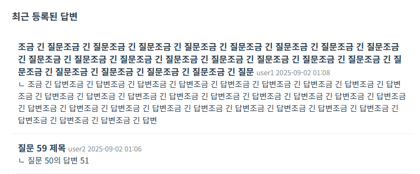
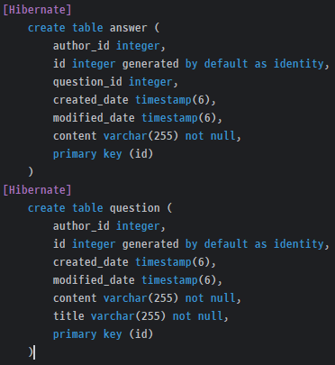

# 🚀 트러블 슈팅
## 최근 답변

```html

<html layout:decorate="~{layout}">
<div layout:fragment="content" class="page-container">
    <div th:each="answer : ${answers}">
        <!--   문제가 된 부분 StackOverFlow     -->
        <div th:field="${answer.question}">

        </div>
        <div th:field="${answer.content}">

        </div>
    </div>
</div>
```

answer -> question -> question이 List<answer>를 가져 다시 처음의 answer를 참조 -> 무한 재귀

🔎 th:field는 내부적으로 `Spring DataBinder`의 바인딩 기능을 사용하기 위해 객체그래프 탐색을 시도한다.

👉 대신에 th:text를 통해 필요한 answer.question.toString()만 호출 하도록 한다.

## UI 변경





시행착오를 통해 그나마 괜찮은 형식으로 바꾸었다.

## `TransientObjectException `

비영속인 객체를 영속인 객체와 함께 저장하려고 하면 발생하는 예외

test에서 간단하게 객체들을 생성하고 persist 하지 않고 사용하려고 했다가 발생했다.

# 👀 기존 기능 버그 감지
## 1 대 다 연관관계 초기화 문제
```java
@OneToMany(mappedBy = "question", cascade = {CascadeType.PERSIST, CascadeType.REMOVE})
private List<Answer> answers = new ArrayList<>();
```

answers가 기존에 = new ArrayList<>(); 초기화 하지 않는 실수가 있었음

## ddl 자동생성 문제

view에서 content의 칼럼 설정이 없어, 자동생성된 content 칼럼이 varchar(255)로 선언됨



```java
@Column(columnDefinition = "TEXT")
private String content;
```